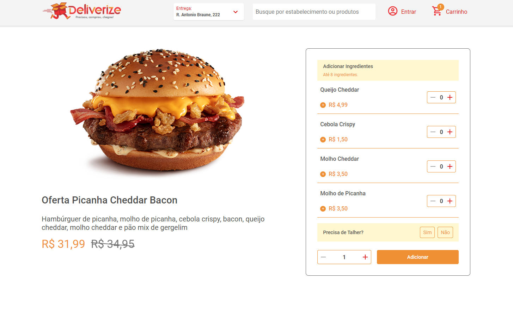

# deliverize



## Sobre o Projeto

Projeto trate se de um tela de comprar de um produto onde podemos selecionar a quantidade e ingredientes extras se quisermos.
O projeto conta com uma página específica para o carrinho onde podemos remover items.


## Libs Usadas

- MSW - Lib para fazer o mock da requisição para api
- styled components - escolhi usá pela sua dinâmica e diminuir o uso de classes e seletores css
- Storybook - ferramenta para criar os componentes isolados da aplicação.

## Testes Unitários

Foi realizado teste unitário de todos os dos componentes da aplicação, funções principais, estados dos aplicativos todos testados além do contexto da aplicação e onde tratamos os pedidos

```
# para rodar os  test
npm run test src

```

## Lib dos componentes | Storybook

```
#Storybook
npm run storybook

```

## Funcionalidades

- Home/produto

  - :heavy_check_mark: Adicionar e remover ingredientes extras
  - :heavy_check_mark: Adicionar e remover a quantidade de itens
  - :heavy_check_mark: Escolher ser precisa de talheres sim ou não
  - :heavy_check_mark: Mostra skeleton do componente enquanto estiver carregando
  - :heavy_check_mark: Mostra uma mensagem de erro quando existir
  - :heavy_check_mark: Conseguimos ver uma notificação quando um item é adicionado

- Pagina/Cart

  - :heavy_check_mark: Podemos ver os itens adicionados anteriormente
  - :heavy_check_mark: Podemos remover o item

- Localstorage

  - :heavy_check_mark: Persiste o estado do carrinho

## Como Rodar

Depois de estar dentro do repositório:

```

npm start

# output - http://localhost:3000/

```

## Lib dos componentes | Storybook

```

#Storybook
npm run storybook

```
